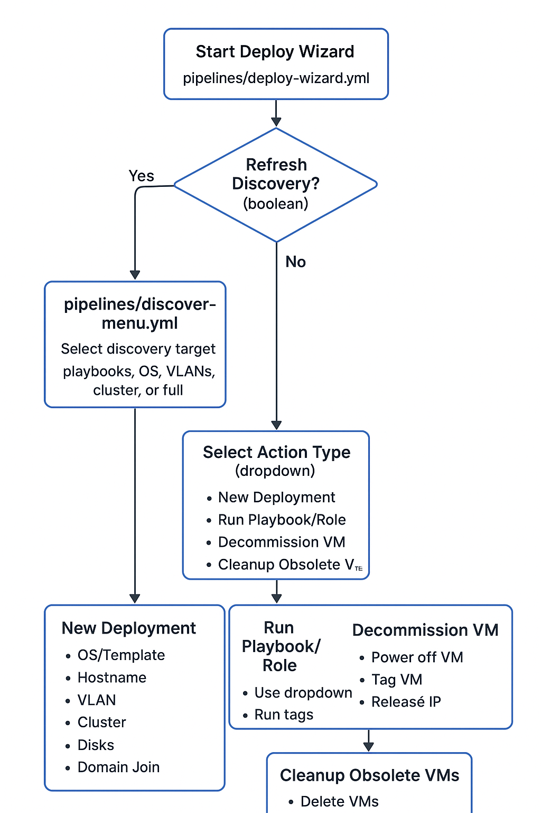

🛠 Azure DevOps – Ansible + VMware + Infoblox Pipelines

This repo integrates Ansible, VMware vCenter, and Infoblox into an interactive Azure DevOps pipeline wizard, with modular discovery pipelines for playbooks, roles, OS templates, VLANs, and clusters.

📂 Repository Layout
.
├── pipelines/
│   ├── deploy-wizard.yml          # Main interactive deployment wizard with optional discovery refresh
│   ├── discover-playbooks.yml     # Discover playbooks and roles
│   ├── discover-os.yml            # Discover OS templates from datastore
│   ├── discover-vlans.yml         # Discover VLANs
│   ├── discover-cluster.yml       # Discover clusters/resource pools
│   ├── discover-full.yml          # Runs all discovery pipelines sequentially
│   └── discover-menu.yml          # Controller pipeline to select which discovery to run
├── playbooks/                     # Ansible playbooks
│   ├── deploy-vm.yml
│   └── ...                        # other playbooks
├── roles/                         # Ansible roles
│   ├── domain_join/
│   └── ...                        # other roles
├── group_vars/
│   └── all/
│       └── vault.yml              # Encrypted sensitive info
└── README.md

🚀 Pipeline Actions

When you run the Deploy Wizard (pipelines/deploy-wizard.yml), you first select:

Refresh Discovery Dropdowns? (boolean)

If true → triggers pipelines/discover-menu.yml to refresh all dropdowns (playbooks, OS templates, VLANs, clusters) before running the action.

Dropdowns remain static until discovery is refreshed again.

Action Type (dropdown):

New Deployment

Run Playbook/Role

Decommission VM

Cleanup Obsolete VMs

Dry Run (boolean) → simulates changes without applying them.

1. New Deployment

Clones a VM from templates in datastore (Zuyderland/3PAR-03-TEMPLATES)

Reserves IP from Infoblox

Sets DNS record

Optional Domain Join (roles/domain_join/)

Asks for:

OS & Version (dropdown from discover-os.yml)

Hostname (free text, .zorg.local appended)

VLAN / Network (dropdown from discover-vlans.yml)

Disks (optional extra disks/sizes)

Cluster & Resource Pool (dropdown from discover-cluster.yml, defaults provided)

Runs Ansible playbooks/deploy-vm.yml

2. Run Playbook/Role

Dropdowns for Playbooks (playbooks/) and Roles (roles/) discovered via discover-playbooks.yml

Supports tags and multiple roles

Dry-run supported

3. Decommission VM

Ask for hostname

Powers off VM in vCenter

Adds tag: Needs to be removed - DDMMYYYY

Releases Infoblox IP

VM remains on datastore until cleanup

4. Cleanup Obsolete VMs

Finds VMs with tag Needs to be removed older than 7 days

Removes VM from vCenter/datastore

Cleans up DNS and Infoblox IP

🔄 Discovery Pipelines

We use modular discovery pipelines to populate dropdowns for the wizard:

Pipeline	Purpose
discover-playbooks.yml	Discover playbooks (playbooks/) and roles (roles/)
discover-os.yml	Discover OS templates in datastore (vCenter folders)
discover-vlans.yml	Discover VLANs
discover-cluster.yml	Discover clusters and resource pools
discover-full.yml	Runs all discovery pipelines sequentially
discover-menu.yml	Controller pipeline: choose which discovery to run (playbooks, OS, VLANs, cluster, or full)

Workflow:

Run discover-menu.yml manually or via the wizard refresh option → generates pipelines/pipeline-parameters.yml.

Commit updated pipeline-parameters.yml to repo → dropdowns are now static.

Run deploy-wizard.yml → uses static dropdowns, but can optionally refresh via refresh_discovery = true.

⚙️ Setup Steps

Clone repo into Azure DevOps project.

Create pipelines for discovery:

discover-menu.yml → manual trigger to refresh dropdowns

Create pipeline for Deploy Wizard:

deploy-wizard.yml → interactive deployment and actions

Run Deploy Wizard, optionally refreshing discovery first.

Commit updated pipeline-parameters.yml after any discovery refresh.

✅ Notes

Sensitive credentials are in group_vars/all/vault.yml (Ansible Vault).

Dropdowns remain static until discovery pipelines are rerun.

Dry-run mode (--check) is available for all actions.

Decommissioned VMs are first tagged, then removed only during cleanup.

OS templates, VLANs, clusters, etc., are dynamically discovered and mapped into dropdowns.
